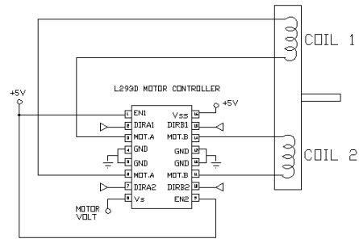
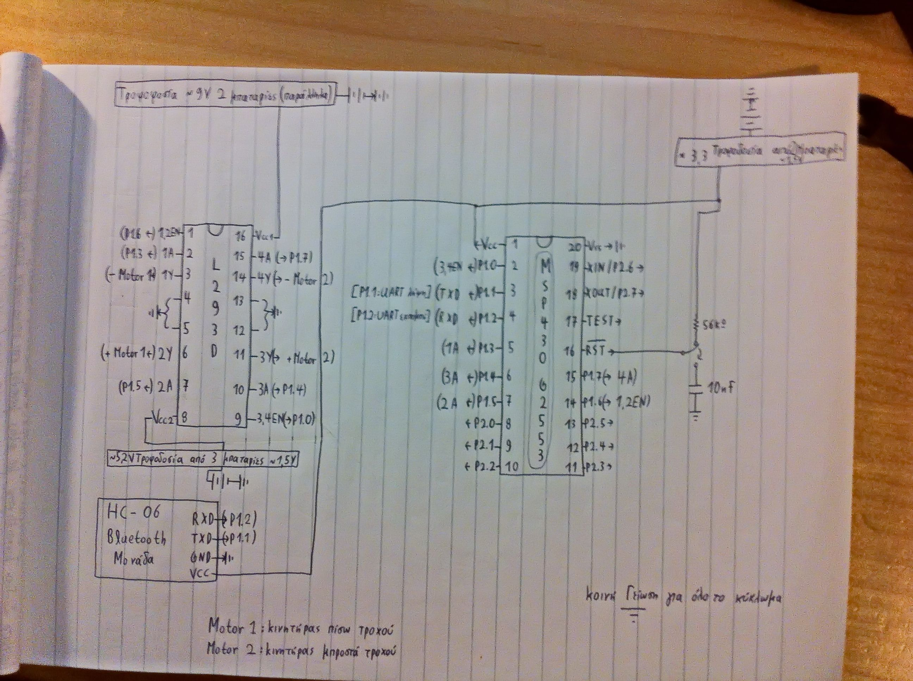
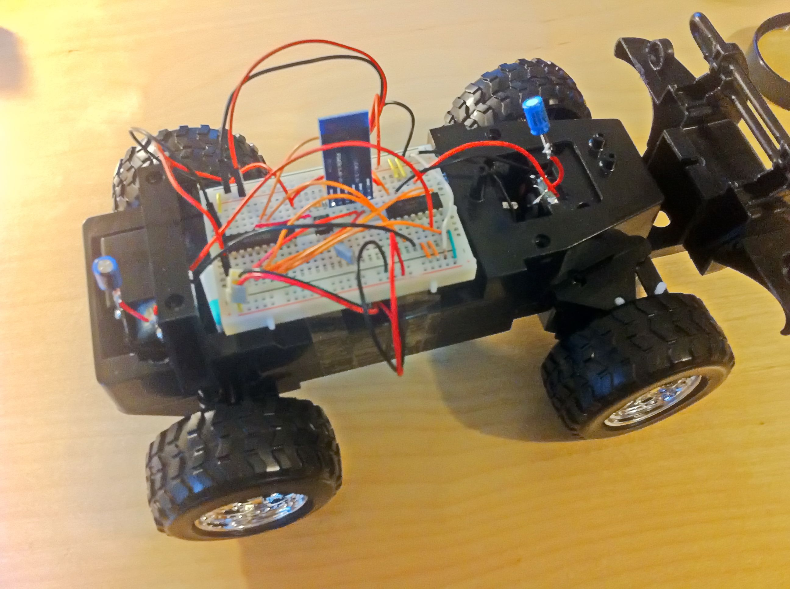
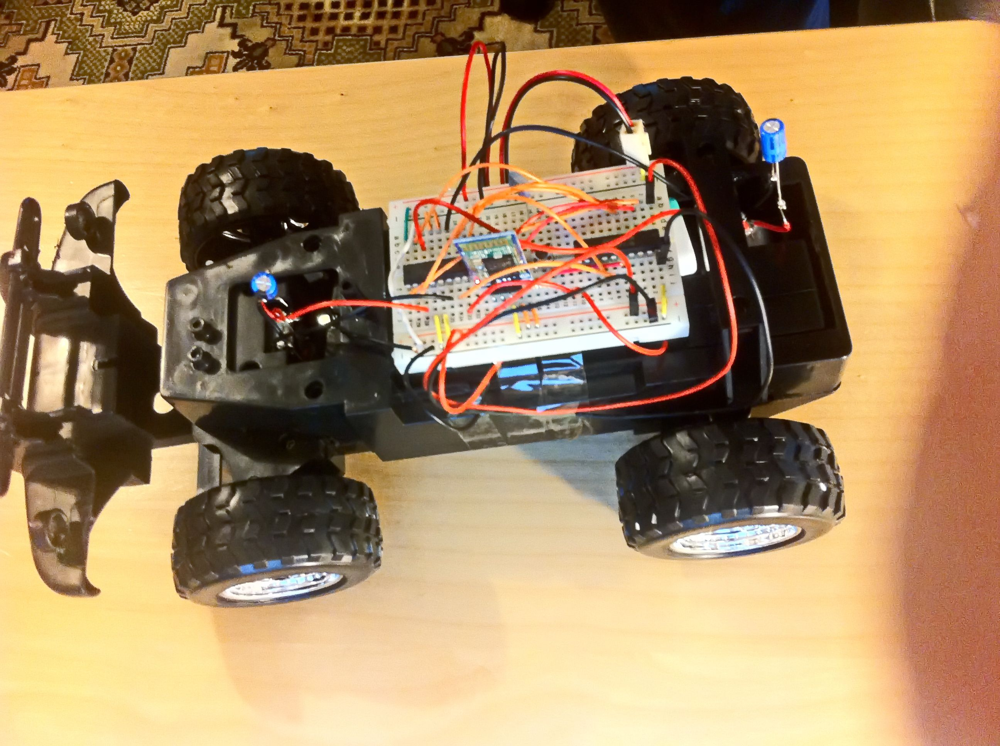
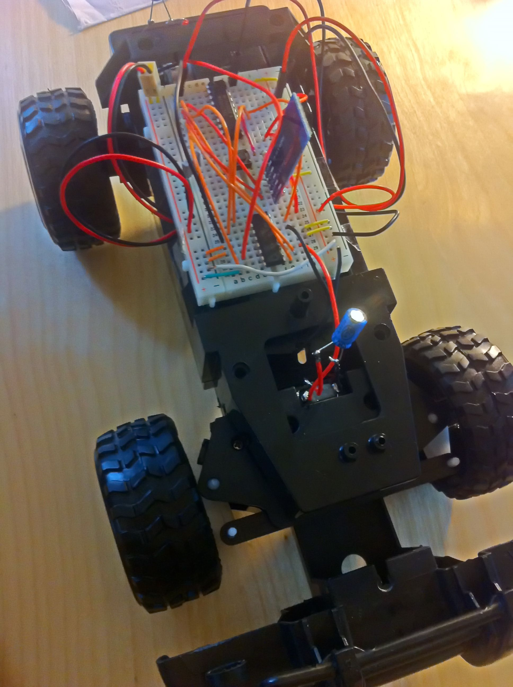
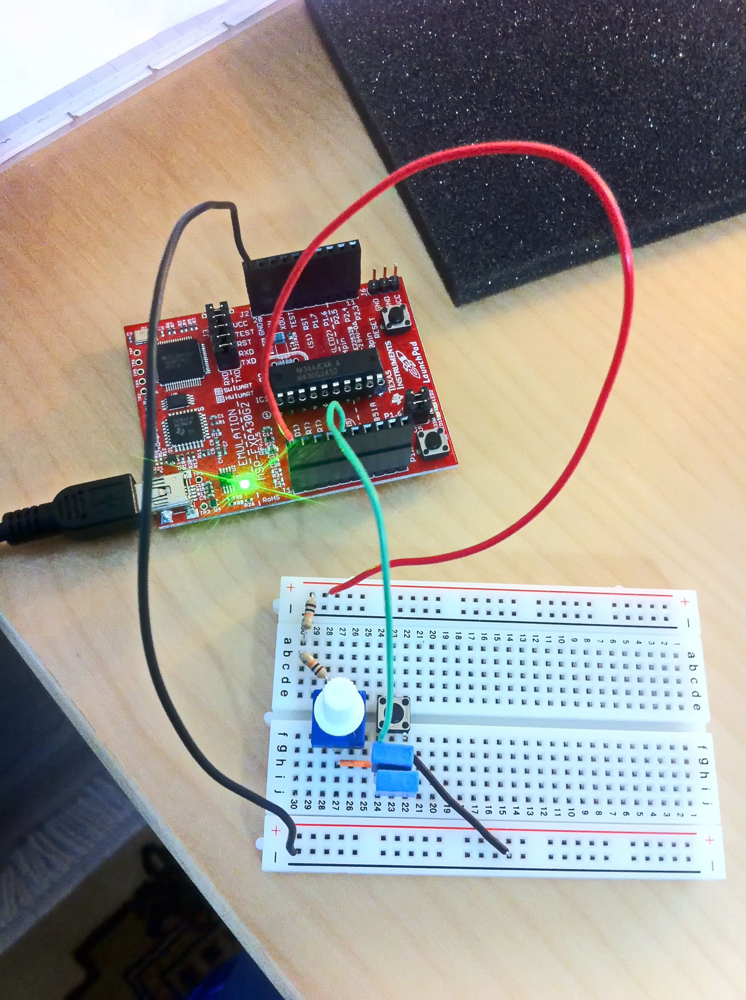
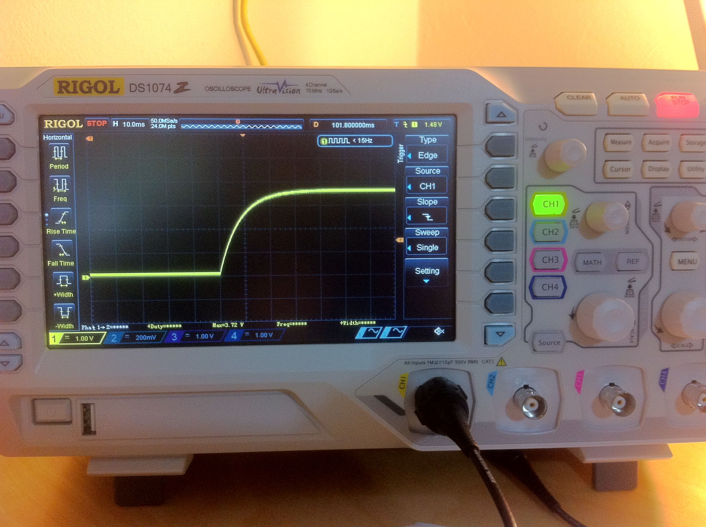
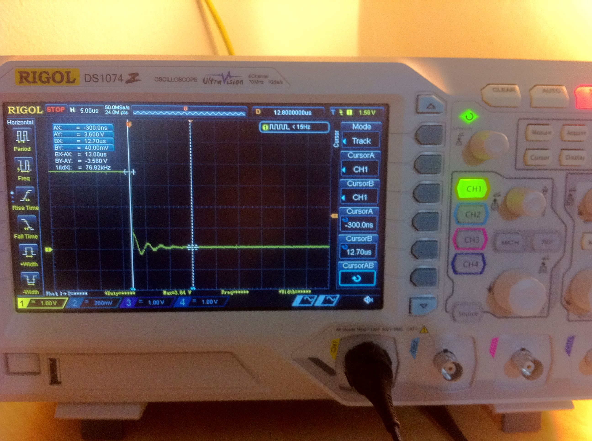
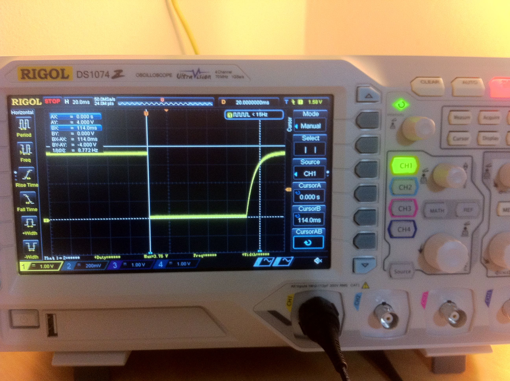
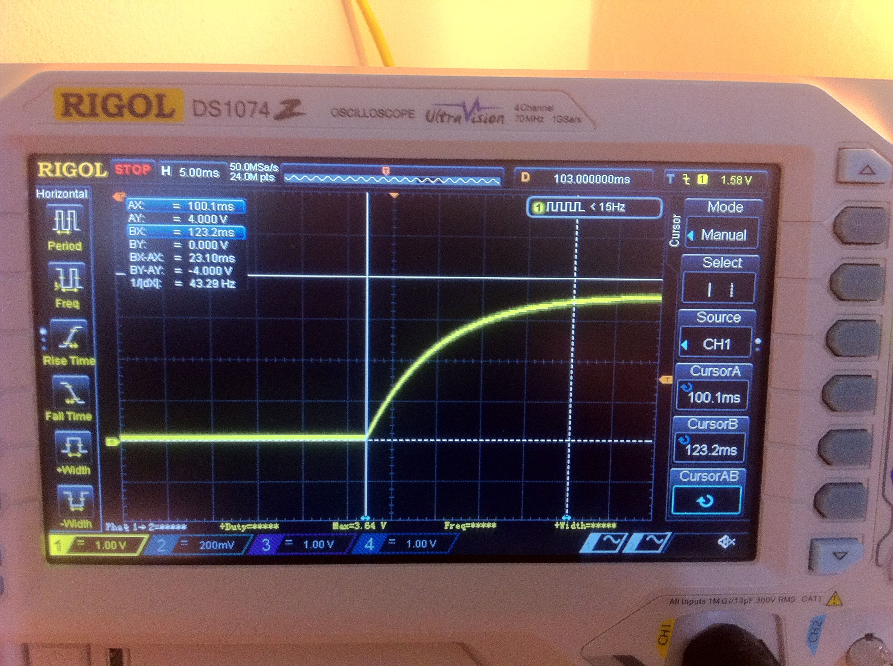

<h1 align="center">
	<a href="https://github.com/KeyC0de/RC_Car">RC Car</a>
</h1>
<hr>


# Description

This is the implementation of a Radio Controlled (RC) car scaled 1-16. When talking about "implementation" I refer to the electromechanical assembly of the parts required, their wiring and microcontroller programming.

The goal is to move the car around ~~telepathically (no just kidding)~~ using a transmitter i.e. remotely controlling it via radio frequency signal waves and technology used to decode and encode those signals on the receive and transmitter ends respectively.

Hardware & Software used:

- the popular programmable MSP430 microcontroller chip (MCU) from Texas Instruments
- HC-06 Bluetooth module
- L293D(ne) H-bridge chip
- IAR Embedded Workbench 7 for Windows, student license for programming
- Windows 8.1 x86_64
- Tera Term and Putty for IO serial comms via UART interface.

You will have to find the datasheets for all those circuits on your own though. A trivial search on the internet will suffice.

Assembling an RC car.. What does that entail? In a basic sense I would say, "Give me the chassis, the wheels and the motors".
And that's pretty much it. I went ahead a bought a toy car for ~15$ disemboweled it (excuse my french) and then created my own wiring circuit using a microcontroller, an h-bridge chip, a bluetooth module and a few wires. I figured that the bluetooth module would make an excellent short distance receiver, of course I can replace that with an radio receiver that works long distance but in this case of this small car, I won't even be able to see exactly where it's headed if it escapes say a 50m distance.

In that case I'm sorry I should have named the project "Bluetooth Car" but it's the exact same procedure (as we shall explore in another project).

Then I found myself 2 motors plugged them in all the right places, made the connections and done. Yeah, you heard correctly 2 not 4 motors, we had to cut off our expenses to save on practicality.. In all seriousness though there was no need for 4 motors at all. The back-wheels motor moves the vehicle forward and backward and the forward motor turns the 2 front wheels left and right, just like in a real non-4WD car.

Now how to make it tick.. I have to program the MSP430 to respond the way I want it to given certain input signals.

To cut a long story short, pressing certain buttons on my computer's keyboard transmits certain signals via bluetooth module to the bluetooth receiver on the car. The latter unit forwards them to the MSP430 which decodes them and sends the control pulses to the h-bridge chip. The H-Bridge which in turn drives the currents powering the RC Car's 4 motors.

H-Bridge stands for Half Bridge. An electrical bridge is a 4 terminal network powered by a power supply and its driving a load. Now the half bridge does the same but it has the special ability of driving 2 motors (aka "loads") together.

Here's the block diagram taken from the datasheet and sketched it to include connections and the motors (i.e. coils).

<p style="text-align: center;">
	
</p>

And here is the complete wiring diagram with pinouts for the entire assembly:

<p style="text-align: center;">
	
</p>

There's a little bit of it in Greek.</br>
If you pay close attention there are actually 3 power sources:

1. The upper left part indicates the power supply for the motors, which consists of x2 9V, 330mAh batteries in parallel (to increase our current demands).
2. The upper right part contains the power supply for the MSP430 which requires ~from 2.8V to 3.5V, for which I used 2 1.6V batteries connected in series (to double the voltage). Measuring with the multimeter the combined voltage was about 3.3V which is great.
3. The third one is upwards of the HC-06 module. As we see it is a ~5.2 V needed to power the L293D H-Bridge IC. I used 3 1.6V batteries here in series connecting the Vcc2 terminal input of the IC.

You might think there was a superfluous use of power here right? Not really, but I could optimize things to split the 5.2 V and with a voltage divider (picking the right resistors) supply some of that current to the low-power MSP430 device. I could do that, but it's beyond the recommended input voltage rating. I don't think it would burn up so easily, but with prolonged use it could damage the unit.

The toy motors used are really toy-level quality so they may glitch and act erratically spontaneously. I didn't face any significant problems with them though. But you can use your own Pro-motors. However, especially with low-quality motors phenomenons such as back-voltage may be triggered. This entails the generation of anti-electromotive force in our circuit which runs against our primary power direction and also negatively affects our circuits.

Which is why I've used a capacitor with a 56kΩ pull-up resistor for the reset signal of the MSP430. This is not necessary per-se but in my opinion it is highly recommended. First off the RST terminal is active low (indicative by the little horizontal dash over it). The capacitor is a bypass capacitor required for suppressing high-frequency noise (discarding it to the ground). Without it the MSP430 would Brownout reset on its own, as it happened to me twice. The resistor is used to delay the amount of time the RST pin needs to reset the MSP430 circuit. According to its datasheet this delay is necessary for the MCU to reset its internal state, otherwise some internal registers were in danger of not being set to their default values.

The down right part indicates a common ground for all our electrical - a unified voltage reference point - important.

M1 is Motor1 for the back wheels.</br>
M2 is Motor1 for the front wheels.</br>

When researching the code, refer to the table below to trace which terminals are connected to the motors and what action each one performs.

**Motor1** - Back axis wheels:

|P1.6 (EN1.2)|P1.5 |P1.3| Action								|
|------------|-----|----|---------------------------------------|
|	0 		 |	X  | X	|STOP (free stop motor due to friction)	|
|	1 		 |	1  | 1	|ACTIVE STOP							|
|	1 		 |	0  | 0	|ACTIVE STOP							|
|	1 		 |	1  | 0	|FORWARD MOVEMENT						|
|	1 		 |	0  | 1	|REVERSE MOVEMENT						|

**Motor2** - Front axis wheels:

|P1.0 (EN3.4)|P1.7 |P1.4| Action								|
|------------|-----|----|---------------------------------------|
|	0 		 |	X  | X	|STOP									|
|	1 		 |	1  | 1	|ACTIVE STOP							|
|	1 		 |	0  | 0	|ACTIVE STOP							|
|	1 		 |	1  | 0	|Turn Right								|
|	1 		 |	0  | 1	|Turn Left								|


I've used a serial COMMs program called Tera Term (Putty also works) which connects to a USB bluetooth module on the PC (which you can get anywhere) transmits the commands to the Car's Bluetooth module (HC-06) and finally to the MSP430.

The MSP430 and the Bluetooth module interface connection:

<p style="text-align: center;">
	
</p>

|MSP430 Pins|HC-06 Pins			|
|-----------|-------------------|
|P1.1		|TXD (transmit end)	|
|P1.2		|RXD (receive end)	|

P1.1 is the UART receive pin. Meaning that it receives data from the Bluetooth HC-06 module.</br>
P1.2 is the UART transmit pin. It transmits data towards the Bluetooth (in theory as that will never happen in our case).</br>
It's worth noting that the HC-06 unit can only act as a slave device (in contrast to say HC-05 which can be both Master & Slave).

The last piece of the puzzle, I ask you, is how do we produce those "commands". Take a minute to think about it then read on.

Well it couldn't have been easier, I just press a keyboard button on Tera Term, then press Enter and it is sent! For instance the '*r*' key means that the forward wheels need to turn right. It is straightforward in the code file `RC Car.c`.

Finally the RC car looks like this:

<p style="text-align: center;">
	
</p>

<p style="text-align: center;">
	
</p>

<p style="text-align: center;">
	
</p>


(I didn't bother replacing the breadboard with a full-blown circuit board and soldering the parts on it, because soldering skills need sharpening. :) )


### Switch Debounce

The MSP430 push-buttons were a menace at first. They were bouncing like a trampoline. What I mean by that is that when I release the push button the voltage does not fall to 0 instantaneously. It bounces for several microseconds between low and high voltage, often times that is enough to retrigger it before it settles below the low-voltage threshold!

Davies's book as well as the website [here](http://processors.wiki.ti.com/index.php/MSP430_LaunchPad_PushButton) from Texas Instruments MSP430 helped me a great deal in debugging the problem and it wasn't long to find a quick solution. So I put together the following circuit, consisting of 2 parallel capacitors 440nF in total and a 30KΩ resistor, which is actually x3 10KΩ resistors one of them a potensiometer (variable resistor). I calculated the new tBounce time:

``tBounce = 0.69 * C * R ~= 9.1ms`

which is long enough to be more than sufficient.

<p style="text-align: center;">
	
</p>

<p style="text-align: center;">
	
</p>


Having the Rigol DS1074Z-S Oscilloscope at my disposal I got the following measurements, which clearly depict the now smooth curve of the capacitor charging when I release the push-button (0->1 transition) as well as the gradual downfall (1->0 transition) free from high current noise.

<p style="text-align: center;">
	
</p>

<p style="text-align: center;">
	
</p>

<p style="text-align: center;">
	
</p>

Ever since I solve the push-button bouncing issue the push-buttons were "bouncing"!

Of course a more expensive instrument would have such circuitry integrated into the chip or the MCU peripherals.


# Code Example

If we were asked to program the MCU such that it runs the car for 1 second forwards then stops for one second and finally it runs in reverse for another single second then our code would be something like the following.

The only non-trivial aspect of this code is how to produce the delay. I did it using 2 loops that are counting up to 72,000 (MSP using the DC0 Submain Clock @ 1MHz). Of course this may not be exactly 1 second but that's the best we can do without a timer.

```c

#include <msp430g2452.h>
	
#define EN1 BIT6 // defining EN1 P1.6 (BIT6 of MSP430 P1 port) as the Enable bit of MOTOR 1 of H-Bridge
	
void main( void )
{
  WDTCTL = WDTPW + WDTHOLD;
	
  DCOCTL = 0;
  BCSCTL1 = CALBC1_1MHZ;
  DCOCTL = CALDCO_1MHZ; // Verifying that Submain clock is selected using DCO as the timer source @ 1Mhz
	
  P1OUT &= ~(EN1 | BIT5 | BIT3); // Initial state P1.6, P1.5, P1.3 = LOW
  P1DIR = EN1 | BIT5 | BIT3; // P1.6, P1.5, P1.3 = Outputs ()
  
  volatile unsigned int i;
  
  P1OUT |= EN1; // Enable MOTOR1
 
  P1OUT |= BIT5;
  P1OUT &= ~BIT3; // 1-0 (P1.5 - P1.3) -> FORWARD - Motor 1
  for ( i = 0; i < 36000; i++ );  // Delay approximately 1 second during which the wheels turns to the right direction - it takes some time to do so so after trial and error I deemed 1 second to be a decent amount of time
  for ( i = 0; i < 36000; i++ );  // forward movement for 1 second
  P1OUT |= BIT3; // 1-1 -> Active Stop - Motor 1
  for ( i = 0; i < 36000; i++ );
  for ( i = 0; i < 36000; i++ ); // Pause Motor1 for 1 second
  P1OUT &= ~BIT5; // 0-1 -> BACKWARD - Motor 1
  for (i = 0; i < 36000; i++ );  // Delay 1 second during which the wheels turn opposite direction
  for ( i = 0; i < 36000; i++ );  // Reverse movement for 1 second
  P1OUT &= ~BIT3; // 0-0 -> Active Stop - Motor 1

  P1OUT &= ~EN1;
}

```


# Contribute

Please submit any bugs you find through GitHub repository 'Issues' page with details describing how to replicate the problem. If you liked it or you learned something new give it a star, clone it, contribute to it whatever. Enjoy.


# License

Distributed under the GNU GPL V3 License. See "GNU GPL license.txt" for more information.


# Contact

email: *nik.lazkey@gmail.com*</br>
website: *www.keyc0de.net*


# Acknowledgements

Technical University of Piraeus, Greece</br>
Microcontrollers & Embedded Systems Class</br>
2014 academic year, Summer term

[43oh Forum topic](http://www.43oh.com/forum/viewtopic.php?p=6381) </br>
D. V. GARDE 
"Programming and Customizing the AVR Microcontroller" (page 204 notably) </br>
J. Davies "MSP430 Microcontroller Basics" Chapter 7.6 Driving Heavier Loads (page 247) </br>
